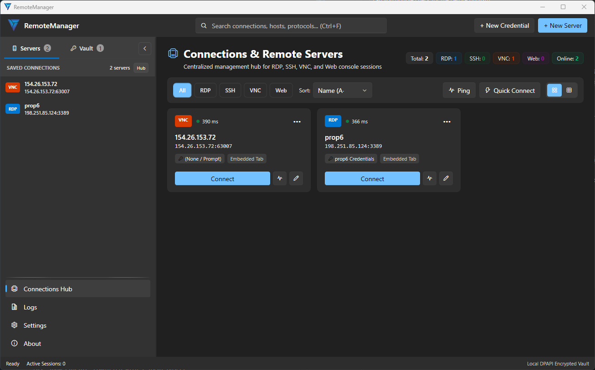

# RemoteManager

<p align="center">
  <strong>Part of the VynTech Ecosystem</strong><br>
  A modern, open-source, native Windows connection & credential manager for RDP, SSH, VNC, and Web sessions with zero credential collisions.
</p>

<p align="center">
  
  
  
  
  
  
  
  
</p>

<p align="center">
  
</p>

---

## 💡 The Problem: Windows RDP Credential Overwrite

If you manage servers or workstations using standard Windows Remote Desktop (`mstsc.exe`), you've likely encountered this frustrating limitation:

Windows Credential Manager indexes saved credentials strictly by the target IP or hostname:
```text
TERMSRV/192.168.1.50
```

Because Credential Manager only stores **a single credential per target key**, checking "Remember me" for a second account (e.g. `Domain\Auditor`) **permanently overwrites** the saved password of your previous account (e.g. `Domain\Administrator`) on that IP.

---

## ⚡ The Solution: RemoteManager

**RemoteManager** is purpose-built to solve this exact problem:

* **Zero Credential Collisions**: Store dozens of unique accounts (`Admin`, `User1`, `ServiceAccount`) pointing to the exact same host or IP without them ever conflicting.
* **Embedded Tabbed Sessions**: Run concurrent RDP, VNC, and Web sessions side-by-side in tabs, with integrated SSH console launch.
* **Flexible Display Modes**:
  * **In-App Tabs**: Seamless multi-tasking across embedded protocols.
  * **Borderless Fullscreen (`F11`)**: Auto-hiding floating top bar (just like native MSTSC / VMware) to minimize, restore, or disconnect.
  * **Detached Windows**: Pop out any tab into an independent window with one click, and dock it back whenever you want.
  * **External Launcher**: Direct launch into native `mstsc.exe` with dynamically injected isolated credentials and automatic teardown.
* **In-App GitHub Release Updates**: Automatic startup version checks, real-time right-aligned footer status, interactive updates center in About, and 1-click installer upgrades with SHA-256 checksum verification.
* **Export & Import Management**: Full-fidelity JSON backups with optional military-grade AES-256-GCM master passphrase protection, CSV spreadsheet export/import, individual and batch `.rdp` file import/export, and flexible conflict resolution (Merge, Overwrite, Clean & Replace).
* **System Theme by Default**: Natively adapts to your Windows light or dark mode in real time.

---

## 🌐 Supported Protocols

| Protocol | Engine | Capabilities |
| :--- | :--- | :--- |
| **RDP** | Native ActiveX (`AxMsRdpClient`) + Isolated Launcher | Full credentials injection, SmartSizing, audio redirection, clipboard sharing, multi-monitor, **active disconnect detection** (session takeover notice & 1-click reconnect) |
| **SSH** | Windows Terminal (`wt.exe`) / OpenSSH | Automatic terminal console launch with sanitized user and port parameters |
| **VNC** | Built-in RFB Viewer + External Viewer Bridge | Embedded tabbed viewer or external bridge (UltraVNC, TightVNC, TigerVNC, RealVNC) |
| **Web** | Microsoft WebView2 (Chromium) | **Isolated profile per connection** — cookies, sessions, and storage never leak between accounts |

---

## 🔄 In-App Updates via GitHub Releases

RemoteManager includes built-in update lifecycle management connected directly to official GitHub Releases (`vyntechau/RemoteManager`):

* **Real-Time Footer Status Indicator**:
  * Positioned on the right of the status bar (e.g. `v1.0.0 (Latest)`, `v1.0.0 (Checking...)`, or `v1.0.0 (Update v1.1.0 available)`).
  * Interactive 1-click shortcut directly opens the About page.
* **Automatic Startup Checks**:
  * Background check runs quietly on application launch without blocking the UI.
* **Dedicated Software Updates Center** (in About View):
  * Dynamic assembly version detection.
  * Release notes and changelog viewer.
  * 1-Click **Download & Install (.msi)** with streaming progress bar, automatic **SHA-256 checksum verification** against `checksums.txt`, and automated installer execution.
  * Direct **Download Portable ZIP** and **View on GitHub** actions.
* **Configurable Update Channel** (in Settings View):
  * Toggle automatic checks on startup on or off.
  * Enable or disable pre-release (beta) channel updates.
  * Manual "Check Now" button with last-checked timestamp display.

---

## 🔒 Security & Privacy Architecture

RemoteManager is built with a **strict local-first, zero-trust mindset**:

1. **Windows DPAPI Encryption**:
   - All passwords and sensitive tokens are encrypted using Windows Data Protection API (`System.Security.Cryptography.ProtectedData`).
   - The cryptographic key is tied directly to your logged-in Windows user account (`DataProtectionScope.CurrentUser`) combined with internal cryptographic entropy.
   - Passwords are **never written to disk in plain text**.
   - *Note: Because DPAPI derives its master key from your Windows profile, credentials are machine- and user-specific.*
2. **100% Local Storage**:
   - All connections and encrypted credentials reside in an embedded SQLite database:
     ```text
     %LocalAppData%\RemoteManager\remotemanager.db
     ```
3. **Isolated Web Profiles**:
   - Each Web session tab runs in an independent Chromium `UserDataFolder` (`%LocalAppData%\RemoteManager\WebProfiles\{ConnectionId}`).
   - Logging into multiple accounts on cloud consoles (AWS, Azure, Proxmox, vCenter, routers) will never cross-pollinate cookies or sessions.
   - Profile cache directories are cleaned up automatically when connections are deleted.
4. **Zero Telemetry & Cloud-Free**:
   - No external API calls, no third-party accounts, and no data tracking.

### 🛡️ Vulnerability Reporting & Security Policy
For security matters and responsible disclosure, please refer to our [Security Policy](SECURITY.md) or reach out directly to:

📧 **[security@vyntech.com.au](mailto:security@vyntech.com.au)**

---

## 📚 Documentation Center

For comprehensive setup guides, architecture overviews, protocol configurations, and FAQs, visit our document center:

📖 **[VynTech Document Center](https://www.vyntech.com.au/documents)**

---

## 🏛️ Project Architecture

```text
RemoteManager/
├── .github/
│   └── workflows/
│       └── build-and-release.yml   # Automated CI/CD (Test, build EXE/MSI, create Releases)
│
├── packaging/
│   ├── Package.wxs                 # WiX Toolset v5 Windows Installer definition
│   └── license.rtf                 # License file bundled in MSI installer
│
├── src/
│   ├── RemoteManager.Core/         # Domain entities, enums, and service contracts
│   │   ├── Models/                 # ConnectionItem, Credential, AppSettings, ProtocolType, UpdateModels
│   │   ├── Interfaces/             # IDatabaseService, IEncryptionService, IProtocolSession, IUpdateService
│   │   └── Services/               # GitHubUpdateService (releases, downloads, SHA-256 verification)
│   │
│   ├── RemoteManager.Data/         # SQLite storage and DPAPI cryptographic services
│   │   ├── SqliteDatabaseService.cs
│   │   └── Security/DpapiEncryptionService.cs
│   │
│   ├── RemoteManager.Protocols/    # Multi-protocol session execution engines
│   │   ├── Rdp/                    # RdpAxClient (ActiveX), RdpHostControl, RdpIsolatedLauncher
│   │   ├── Ssh/                    # SshSessionHandler, SshClientDetector
│   │   ├── Vnc/                    # VncSessionHandler, VncHostControl, VncSharpCore engine
│   │   └── Web/                    # WebView2SessionControl (isolated profiles)
│   │
│   └── RemoteManager.App/          # WPF-UI Fluent Windows 11 presentation layer
│       ├── Views/                  # MainWindow, ConnectionsView, SettingsView, LogsView
│       └── ViewModels/             # MainViewModel, ConnectionsViewModel, LogsViewModel
│
├── tests/
│   └── RemoteManager.Tests/        # Automated unit and integration tests (xUnit)
│
├── Makefile                        # Cross-platform build & packaging automation
├── build.ps1                       # Native PowerShell packaging script (EXE & MSI)
└── dotnet-tools.json               # WiX Toolset v5 tool manifest
```

---

## 🚀 Getting Started

### Prerequisites
- Windows 10 (Build 19041+) or Windows 11
- [.NET 8.0 SDK](https://dotnet.microsoft.com/download/dotnet/8.0) or higher

### Option 1: Run via Command Line
```powershell
# Clone the repository
git clone git@github.com:vyntechau/RemoteManager.git
cd RemoteManager

# Build and run
dotnet run --project src/RemoteManager.App
```

### Option 2: Run the Compiled Binary
After building, double-click:
```text
src\RemoteManager.App\bin\Debug\net8.0-windows\RemoteManager.App.exe
```

### Run Automated Tests & Code Coverage
```powershell
# Run all 190 unit & integration tests
dotnet test

# Run tests with code coverage analysis (using coverlet.runsettings)
dotnet test --collect:"XPlat Code Coverage" --settings coverlet.runsettings
```

---

## 📦 Building & Packaging (EXE & MSI)

RemoteManager provides full build automation to produce both **portable single-file executables** and an **MSI Windows Installer** using **WiX Toolset v5**.

### Release Artifacts
When built, release artifacts are generated into the `artifacts/` folder:
- **`RemoteManager-v<version>-win-x64-portable.zip`**: Self-contained single-file bundle that runs instantly on Windows 10/11 without requiring .NET installation or administrator rights.
- **`RemoteManager-v<version>-win-x64-Setup.msi`**: Standard Windows Installer package:
  - Installs to `C:\Program Files\Vyntech\Remote Manager\`
  - Creates Start Menu & Desktop shortcuts with the Vyntech application icon
  - Full integration with Windows **Installed apps / Add or remove programs** (ARP)
  - Supports silent enterprise rollout:
    ```cmd
    msiexec /i RemoteManager-v1.2.0-win-x64-Setup.msi /qn
    ```
- **`checksums.txt`**: SHA-256 integrity verification hashes for all built assets.

---

### Option 1: Using `make`
Standard cross-environment build commands:
```bash
# Display help and all available targets
make help

# Run all 216 unit tests
make test

# Publish self-contained portable EXE and create portable ZIP
make exe

# Build Windows Installer (.msi) using WiX v5
make msi

# Full pipeline: clean, test, build portable ZIP, build MSI, and generate SHA-256 checksums
make all

# Clean build artifacts, temporary obj/bin directories, and WiX cache
make clean
```

### Option 2: Using PowerShell
Native Windows automation script:
```powershell
# Build everything (Tests, Portable ZIP, MSI installer, and SHA-256 checksums)
.\build.ps1 -Target All -Version 1.2.0

# Build single-file portable EXE & ZIP only
.\build.ps1 -Target Exe

# Build Windows Installer MSI only (auto-generates version from git tag or parameter)
.\build.ps1 -Target Msi -Version 1.2.0

# Run automated unit test suite
.\build.ps1 -Target Test

# Clean build artifacts and staging files
.\build.ps1 -Target Clean
```

---

## 🧪 Testing & Code Quality Architecture

RemoteManager enforces enterprise-grade engineering standards with an exhaustive automated test suite. The project features **238 unit and integration tests** reaching **100.00% line coverage** across every domain assembly:

```text
========================================================
 RemoteManager Test Coverage Summary
========================================================
Overall Line Coverage   : 100.00% (4,308 / 4,308 lines)
========================================================
```

| Assembly | Line Coverage | Test Scope & Core Focus |
| :--- | :---: | :--- |
| **`RemoteManager.App`** | **100.00%** | Full MVVM ViewModel lifecycles (`MainViewModel`, `ConnectionsViewModel`, `LogsViewModel`, `SessionTabViewModel`), tab hosting, UI commands, ping batching, dispatcher safety, in-app update checks, and import/export dialog management |
| **`RemoteManager.Core`** | **100.00%** | Full-fidelity JSON, CSV, and RDP export & import serialization engines, AES-256-GCM PBKDF2 passphrase encryption, GitHub release update checking & checksum verification, connection validation, protocol rules, settings configuration, and high-throughput asynchronous `LogEngine` channel reader/writer |
| **`RemoteManager.Data`** | **100.00%** | SQLite storage operations, table creation, schema migrations, and Windows DPAPI cryptographic security services |
| **`RemoteManager.Protocols`** | **100.00%** | SSH client auto-detection (OpenSSH, PuTTY, KiTTY), VNC client resolution, argument masking, and session launching |
| **Total Solution** | **100.00%** | **Complete coverage across all 4,308 executable lines** |

### Architecture & Test Isolation Principles
- **COM & ActiveX Abstraction**: High-level interface contracts (`IRdpHostControl`, `IVncHostControl`, `IWebViewSessionControl`) allow testing tab session lifecycles, sizing, and reconnection flows without hardware-dependent COM registrations.
- **Process Launcher Isolation**: External system processes (`mstsc.exe`, `explorer.exe`, SSH consoles, custom VNC viewers) are abstracted behind mockable launch delegates to prevent headless CI deadlocks while verifying exact argument strings.
- **Cryptographic Independence**: Windows DPAPI encryption services run against isolated memory scopes and temporary SQLite databases, ensuring zero cross-test interference or persistent credential footprint.
- **Thread-Safe Dispatching**: Dispatcher calls are guarded with safe-dispatch fallbacks (`SafeDispatch`), ensuring unit tests run reliably in both headless non-WPF test runners and interactive UI environments.

---

## 🤖 Continuous Integration & Automated Releases (GitHub Actions)

An automated production CI/CD workflow is included in [`.github/workflows/build-and-release.yml`](.github/workflows/build-and-release.yml), running on Node.js 24 with a visual modular DAG dependency diagram and strict job timeouts:

```text
                  ┌──> Job 2: Build Portable ZIP (win-x64) ──┐
Job 1: Run Tests ─┤                                          ├──> Job 4: Bundle & Checksums ──> Job 5: Publish Release (Tags)
                  └──> Job 3: Build MSI Installer (WiX v5) ──┘
```

- **Job 1: `test` (Unit & Integration Tests)**:
  - Executes all 238 automated unit tests (`dotnet test`) with a 15-minute strict timeout to deliver fast feedback on PRs and pushes.
- **Job 2: `build-portable` (Portable ZIP)**:
  - Runs in parallel after `test` succeeds; publishes the self-contained single-file win-x64 binary and portable ZIP.
- **Job 3: `build-installer` (WiX v5 MSI)**:
  - Runs in parallel after `test` succeeds; compiles the native WiX Toolset v5 Windows Installer (`.msi`).
- **Job 4: `package` (Bundle & Checksums)**:
  - Merges build artifacts, computes SHA-256 verification hashes, and uploads the distribution bundle.
- **Job 5: `release` (Publish GitHub Release)**:
  - Triggers on version tags (`v*`) or manual `workflow_dispatch` release; attaches the release packages and auto-generates release notes.

## 🤝 Contributing & Community

Contributions are warmly welcome! Please see our [Contributing Guide](CONTRIBUTING.md) for details on setting up your environment, coding conventions, and submitting pull requests. All participants are expected to adhere to our [Code of Conduct](CODE_OF_CONDUCT.md).

---

## 🌌 VynTech Ecosystem

**RemoteManager** is an open-source project by **[VynTech](https://github.com/vyntechau)**.

VynTech focuses on crafting high-performance, secure, and developer-first tools for cloud engineering, systems administration, and automated infrastructure environments.

---

## 📄 License & Attributions

- RemoteManager is licensed under the **[MIT License](LICENSE)** — free for personal and commercial use.
- Third-party open-source libraries and notices are documented in **[THIRD-PARTY-NOTICES.md](THIRD-PARTY-NOTICES.md)**.
